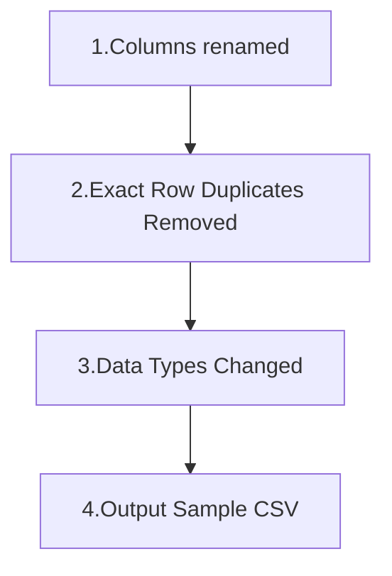

# ANNEX TECHNOLOGIES - Data Engineer Case Study
by [Kevin Odhiambo](https://kevin.yaspi.tech)

> [!Note]
> This is a fictitious case study of a phone company, ABC Phones.

## Introduction
ABC Phones offers smartphones to customers through installment-based credit plans and manages these accounts throughout the repayment period. Customers make regular payments toward their outstanding balances, and credit decisions play a critical role in both portfolio performance and customer experience.

While ABC Phones has systems to process payments and manage accounts, their data engineering and analytics infrastructure is still maturing.

This is a scalable codebase that addresses their current challenges.

## ELT
The pipeline uses an ELT approach and loads all the data from source into our `postgres` warehouse. Users don't even need to know the specific files in the datasets. It loads everything from the source destination.

The good thing with this approach is that users don\'t need to even create any tables beforehand. But the database has to exist.

## Assumptions
The following assumptions are made for this project.
1. The Credit Data will always be accompanied by a relevant definitions file to allow the scripts in data_profiling.py to successfully create the 
resultant tables.
2. There is a "data folder" with the following structure in the root file (Same level as README)
3. Excel data needed for analysis are in `sheet1` as import always ignores other sheets in the workbook. Other data sheets will be factored for indepth engineering in production mode.
4. Only Excel type files will be ingested (.csv,.xlsx,.xls)
5. For `Credit Data`, they will be in a separate folder as `.csv` and possibly include an accompanying definitons file as `.xlsx` or `.xlx`.
6. The data cleaning script only runs once a day since it uses ***current date*** as part of file name for easy identification. This batch processing is good for aggregated data. At the moment running the **cleaning pipeline** twice will **SKIP** for a file that has already been processed. Running the cleaning script more than once in a day would **normally** overwrite existing data which is the default behaviour of the `.to_csv` function. Passing `mode='a'` would append new rows at the bottom of the file. This defeats the cleaning step of removing exact row duplicates already applied. If such duplicates exist in the appended data, the removing duplicates function would need to be called again on the new dataset. If the appending behaviour is desirable, e.g. in case new urgent information comes in, I have added an environment variable `RUN_PIPELINE_ONCE_A_DAY` that can be toggled to achieve this.

```
root folder
    ├── data folder
    │   ├── original (original data)
    │   └── staging (copy of original data)
    │       ├── NPS Data.xlsx
    │       ├── Sales and Customer Data.xlsx
    │       └── credit data folder
    │           ├── Credit Data - 01-01-2025.csv
    │           └── Credit Data - 01-02-2025.csv
    └── README.md
```

## Setup
1. Clone the repo using `git clone https://github.com/odhiambokevin/Annex_DE_Odhiambo.git`
2. Setup a virtual environment using an environment manager of your choice to install the project dependencies in the `requirements.txt` file. UV with python version 3.12.3 is used here.
To install, using UV check out this [link](https://docs.astral.sh/uv/getting-started/installation/)
4. Create an .env file that reads the project environment variables. Refer to the `.env.examples` file.

The BASE_DIR variable is used to set the root folder location using the `os module` as in `scripts/data_profiling.py`

## Cleaning Script
The cleaning script uses an order, in line with python's interpreted nature. For instance, the first step involves cleaning all the column names by standardizing them. These datasets with clean columns are used in the subsquent steps. The output of a preceeding step is used as the input in the proceeding step.

For ease of demonstration, stale datasets are kept in the code for producability of the steps. Of course this behaviour would change for a production level database.

### Cleaning sequence

## Quality Checks
The data quality check is run in a script `quality_checks.py`. All the dataframes/tables/file are loaded and data-specific rules are applied. The script iterates through all the data and finds if any of the data files qualify for any of their specific columns to go through a quality check.

This helps in optimization of `compute` since only business specific rules are checked against avoiding the need to run the check all through all columns as this may be expensive in production and at scale.

Rules defined in the `quality_checks.py` are arbitrary and demonstration only. I can modify them to respond to business intelligence needs.

For the data quality check the following checks are run:

### 1. Null Checks
The script for the null checks is not generic and is designed after a careful examination of the data. The script defines specific null thresholds for specific files derived from the cleaned data. Certain tables/dataframes **cannot** have their null thresholds exceeded and if they do then the pipeline **stops**. This means that particular tables/file/dataframe did not meet its threshold and since it is a critical file, it is not processed at all. It raises the need for further cleaning or examination. An email alert is then sent to the admin(or defined recipients).

For other files whose data is not as sensitive but there is need to see extreme null thresholds exceeded, the pipleine just alerts the admin via email when their null thresholds are exceeded but and the pipeline continues processing thw whole file.

> [!Note]
> It will need internal policy to determine which columns are more data sensitive than others.

For this demonstration the following rules have been defined.

The `'loan_price'` field in the worksheet `sales_details` in the `sales_and_customer_data` workbook should have nulls less than 0. The current value of 3 missing values transalting to 0.01% should stop the entire pipeline with the `stop_pipeline` set to `True`. But for the `'adjustment_amount '` in the `merged_credit_data` table the threshold set is 30%. So the current 95.97% will send an alert but will not stop the pipeline.

This is achieved because I set whether I want the pipeline to stop or not with the `stop_pipeline` dictionary that accepts boolean values.

sample output
```bash
qualityCheckLogger: 2026-05-11 10:02:37,240 INFO: - Starting Quality Check for: sales_and_customer_data_sales_details
qualityCheckLogger: 2026-05-11 10:02:37,240 CRITICAL: - [CRITICAL FAILURE - STOPPING PIPELINE] Threshold Violated in 'sales_and_customer_data_sales_details'! Column 'loan_price' has 0.01% nulls (Limit: 0.00%)
qualityCheckLogger: 2026-05-11 10:02:40,910 INFO: - Starting Quality Check for: merged_credit_data
qualityCheckLogger: 2026-05-11 10:02:40,911 ERROR: - [WARNING] Threshold Violated in 'merged_credit_data'! Column 'adjustment_amount' has 95.57% nulls (Limit: 30.00%)
```
Email output
```bash
    Loger: qualityCheckLogger
    Time: 2026-05-11 10:02:40,911
    Module: quality_checks
    Line: 91
    Message: [WARNING] Threshold Violated in 'merged_credit_data'! Column 'adjustment_amount' has 95.57% nulls (Limit: 30.00%)
```

```
    Loger: qualityCheckLogger
    Time: 2026-05-11 10:02:37,240
    Module: quality_checks
    Line: 88
    Message: [CRITICAL FAILURE - STOPPING PIPELINE] Threshold Violated in 'sales_and_customer_data_sales_details'! Column 'loan_price' has 0.01% nulls (Limit: 0.00%)
```
### 1. Range Checks
I do a range check on the `customer_age` in the `merged_credit_data` to identify ages below 18 and above 90.
We don't want the pipeline to stop for if this check is failed. We just need to see if there are conspicuous data that may need further examination.

We see that `84.28%` of our customers are either below 18 or above 90 and this calls for further investigation. Further check reveals that customer_age is actually the number of days the customer has been with the company, that is number of days since loan sale date.

log output terminal
```bash
qualityCheckLogger: 2026-05-11 12:53:18,620 ERROR: - [WARNING] Range Violation in 'merged_credit_data'!
Column 'customer_age' has 60221 records (84.28%) outside allowed range [18-90].
```
sample email
```bash
 Loger: qualityCheckLogger
    Time: 2026-05-11 12:53:18,620
    Module: quality_checks
    Line: 113
    Message: [WARNING] Range Violation in 'merged_credit_data'!
Column 'customer_age' has 60221 records (84.28%) outside allowed range [18-90].
```
A brief view of this data implies ages well out of acceptable range.

```sql
      loan_id      | customer_age 
-------------------+--------------
 recshsSkaJzHP663H |          246
 rec3WeGAgR8E7ai5J |          233
 recAvwoRHSCytDGyv |          572
 recXY01XbbKZhLt42 |          104
 reciFeQteqkuTsQnC |          285
 recVM1aj5WpWXTn2A |          226
 recwTquJZbvkaTCnL |          224
 recfkxQ2DuCs5In34 |          240
 recdt7CH6uRxc5nW6 |            6
```
The pipeline does not stop. Relevant admins are notified and this could be a mismatch of column names.

## Feature Engineering
In production, feature engineering will be done from cleaned datasets and the results stored in intermediate schema. This is the schema that analysts will have access to since all the data here have passed all qaulity checks and have been feauture engineered. I other words, the output of the `feature_engineering.py` will be uploaded to an `intermediate` schema.
The `calculate_age_band` function takes in the cleaned data, loops through each on of them and if it finds in any of them a field called 'date_of_birth', it uses it to calculate the age band for that particular record.

sample output
```bash
            date_of_birth            loan_id             createdat_utc   age    age_band
 1992-01-15T00:00:00+03:00  recB62iDqCzZRSLvJ  2025-03-03T12:12:02.196Z  34.0    26–35
 2002-04-13T00:00:00+03:00  recYkhiMo3z86wqq8  2025-03-03T12:12:02.967Z  24.0    18–25
 1991-05-17T00:00:00+03:00  recVJkba3KsQiPdQ0  2025-03-03T10:32:05.687Z  34.0    26–35
 1969-01-01T00:00:00+03:00               None  2025-03-03T10:32:06.385Z  57.0      55+
       2003-12-31 00:00:00               None  2025-12-31T09:30:47.083Z  22.0    18–25
       1988-02-12 00:00:00               None  2025-12-31T09:33:49.212Z  38.0    36–45
       1990-07-08 00:00:00               None  2025-12-31T09:38:42.418Z  35.0    26–35
       2000-04-07 00:00:00               None  2025-12-31T09:38:43.339Z  26.0    26–35
       1993-12-28 00:00:00               None  2025-12-31T09:39:38.340Z  32.0    26–35
```
### age_band
### avg_monthly_income_band
### days_past_due
### risk_category
For developing a risk score, the following sample columns from `merged_credit_data` was used. This is just for demonstration and in production a detailed multidepartment approach will be employed. Some of the definitions in `accounts_status_l1` are not clear so only obvious implications were used.

- arrears - amount customer is behind
- account_status_l1 - category of credit status
- days past due - days customer is behind on payment

sample output
```bash
arrears  days_past_due               account_status_l1 risk_category
0  48279.0            239           First Payment Default     High Risk
1  58199.0            149  Cancelled Returned past 3 mths      Low Risk
2      0.0              0                   Paid Off Loan      Low Risk
3      0.0              0                 Existing Active      Low Risk
4  19210.0            117                       Write Off      Low Risk
```
## Portfolio Analysis

### Delinquency rate
To make the pipeline scalable, we are loading whole cleaned data, and iterating through the dataframes to find the particular one that matches our criteria for calculating delinquency rate. In this case it is the `merged_credit_data` dataframe.

```bash
--------------------------------------------------
   DELINQUENCY RATES REPORT   
--------------------------------------------------
merged_credit_data   : 44.06%
--------------------------------------------------
```
### Loss rate
To calculate loss rate, I looked for a column with `Write off` and the next best column to use ro calculate the loss rate. 
            loss rate = write off / total portfolio
`closing_balance` was used in this case.

```bash
--------------------------------------------------
   LOSS RATE REPORT   
--------------------------------------------------
merged_credit_data        : 20.90%
---------------------------------------------
```
### Payment collection rate
To calculate for the payment collection rate we get what is actually being collected versus what is due for payment. The columns in our datasets that perform this are `payment_amount` and  `expected_payment`.

```Collection rate = (payment_amount / expected_payment) * 100```

```bash
--------------------------------------------------
   PAYMENT COLLECTION REPORT   
--------------------------------------------------
merged_credit_data        : 42.35%
--------------------------------------------------
```
### Customer retention rate